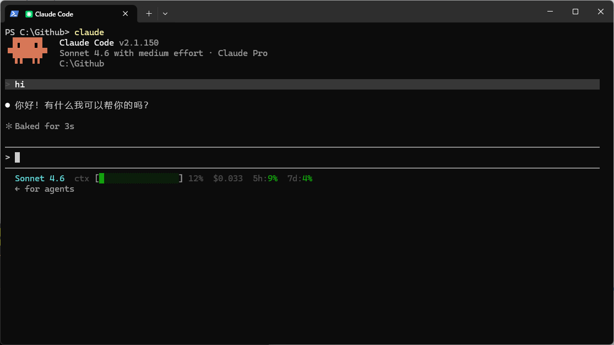

# Tyndall-Skills

精选的自定义 Claude Code 技能（SKILL.md 模板）和自动化脚本集合，旨在扩展 AI 能力并简化复杂的开发和生产力工作流程。

[English](README.md) | 中文

## 技能快速跳转
- [Claude Code 状态栏](#1-claude-code-状态栏-cc-plus)
- [PDF 压缩器](#2-pdf-压缩器-pdf-compressor)
- [PDF 图表提取器](#3-pdf-图表提取器-pdf-figure-extractor)
- [视频字幕提取器](#4-视频字幕提取器-video-subtitle-extractor)
- [项目架构摘要](#5-项目架构摘要-project-summary)
- [如何将技能添加到 Claude Code](#如何将技能添加到-claude-code)

---

## 可用技能

### 1. Claude Code 状态栏 (`cc-plus`)
跨平台的 Claude Code 增强技能，为 Windows 和 macOS 同时提供自定义状态栏与响应完成提示音。



- **触发条件：** “配置 Claude Code 状态栏”、”Claude 回复完成后播放提示音”，或 bash/jq 状态栏脚本失败时使用。
- **核心功能：**
  - 显示模型名称、按使用量上色的上下文进度条、当前会话累计花费（美元）以及 5 小时 / 7 天速率限制百分比。
  - Claude 完成响应后自动播放提示音（叮咚 / 铃声 / 蜂鸣），macOS 使用 `afplay`，Windows 使用 PowerShell。
  - 颜色警告阈值可通过 `WARN_PCT` / `DANGER_PCT` 环境变量自定义。
  - 自动检测 Python 或 Node.js —— 不依赖 `jq`，无 Unicode 编码错误。
  - **彩蛋宠物 🐣：** 状态栏行尾住着一只可选的金色卡皮巴拉 `(^oo^)` —— 它会在刷新之间做待机动画（嚼东西、眨眼），并根据上下文用量 / 花费 / 速率限制冒出小表情（`♥♥♥` `zzz` `!!!`）。纯本地运行，**0 token 消耗**。
- **设置与前提条件：**
  - 系统 PATH 中需要 Python 3 或 Node.js。
  - 将该技能安装到 `~/.claude/skills/cc-plus/`（参见 [如何将技能添加到 Claude Code](#如何将技能添加到-claude-code)），然后对 Claude 说 **”帮我配置 Claude Code 状态栏”** —— 它会自动检测操作系统和运行时，询问提示音偏好，并完成脚本与 `settings.json` 的全部配置。

#### 🐣 认识你的宠物 —— 金色卡皮巴拉

状态栏行尾住着一只金色的小卡皮巴拉，移植自 Claude Code 内置的 companion 彩蛋。它只是一行文字，却是**活的**：每次状态栏刷新都会重新读取当前时间和会话状态，所以这小家伙会不停地动、不停地对你的状态做出反应。

**待机动画**（时间驱动，刷新之间持续变化）
- 嚼东西：`(^oo^)` → `(^Oo^)` → `(^oO^)`
- 眨眼：偶尔快速 `(-oo-)` 一下

**心情** —— 眼睛随上下文用量变化：

| 上下文 | 眼睛 | 状态 |
|---|---|---|
| < 50% | `^` | 开心 —— `(^oo^)` |
| 50 – WARN | `·` | 清醒 —— `(·oo·)` |
| WARN – DANGER | `-` | 疲惫 —— `(-oo-)` |
| ≥ DANGER | `×` | 累瘫 —— `(×oo×)` |

**偶发反应** —— 时不时冒出一个符号 + 一句暖心/俏皮的话；话语从短语池里随时间轮换，所以每次都不太一样：

| 符号 | 触发条件 | 短语示例（卡皮巴拉淡定治愈风） |
|---|---|---|
| `♥♥♥` | ctx 宽裕时 | you got this · proud of you · we're vibing |
| `~~~` | 随机 | la la la~ · just chillin' · doot doot doot |
| `zzz` | ctx ≥ WARN | 5 more minutes · so very sleepy · ok... carry on |
| `$$$` | 花费 ≥ $1 | worth every cent · treat yourself · ooh, fancy |
| `!!!` | 限额 ≥ 90% | breathe, you ok? · ease up soon · take a lil break |

所以你会时不时看到 `(^oo^) ♥♥♥ you got this` 或 `(×oo×) !!! breathe, you ok?` 这样的画面。

**技术原理**
- **0 token，纯本地** —— 它由状态栏脚本本地计算、画在你的终端里，**任何内容都不会发给模型**。
- 符号是金色加粗，话语用暗色柔和呈现，不抢状态栏其它信息。
- 想换台词？编辑 `statusline.py` / `statusline.js` 里的 `QUIPS` 表即可。
- 容错设计 —— 一旦出错宠物就静默隐藏，状态栏其余部分完全不受影响。

### 2. PDF 压缩器 (`pdf-compressor`)
使用 Ghostscript 自动压缩大型 PDF 文件，确保它们符合 API 限制或优化处理速度。

- **触发条件：** “压缩 report.pdf”、“减小 PDF 大小”，或在文件 > 10MB 时自动激活。
- **核心功能：** 
  - 多种质量预设（`screen`、`ebook`、`printer`、`prepress`）。
  - 自动备份原始文件。
  - 针对包含大量图像的文档显著减小体积。
- **设置与前提条件：**
  - **依赖项：** [Ghostscript](https://ghostscript.com/releases/gsdnld.html)。
  - 确保 `gswin64c` (Windows) 或 `gs` (Linux/macOS) 已添加到系统 PATH。

### 3. PDF 图表提取器 (`pdf-figure-extractor`)
使用 [TF-ID](https://github.com/ai8hyf/TF-ID)（基于 Florence2）目标检测模型从 PDF 文档中提取图表和表格。

- **触发条件：** “提取此 PDF 中的所有图表”、“获取 paper.pdf 中的表格”。
- **核心功能：**
  - 高精度检测学术论文布局元素。
  - 输出裁剪后的图像和 Markdown 索引，方便查看。
  - 支持特定页码范围提取。
- **设置与前提条件：**
  1. **安装 Poppler：**
     - **Windows：** 从 [poppler-windows](https://github.com/oschwartz10612/poppler-windows/releases) 下载并将 `bin` 文件夹添加到系统 PATH。
     - **macOS：** `brew install poppler`
     - **Linux：** `sudo apt-get install poppler-utils`
  2. **创建 Conda 环境：**
     ```bash
     conda create -n TF-ID python=3.10 -y
     conda activate TF-ID
     pip install torch torchvision transformers timm einops pillow opencv-python pdf2image accelerate
     ```

### 4. 视频字幕提取器 (`video-subtitle-extractor`)
从 Bilibili 和 YouTube 视频中提取字幕并保存为纯 `.txt` 文件。

- **触发条件：** “从这个 YouTube 链接提取字幕：[URL]”、“获取 Bilibili 视频的字幕”。
- **核心功能：**
  - 支持 Bilibili 和 YouTube。
  - 智能语言优先级（默认为中文/英文）。
  - 通过 `cookies.txt` 支持登录限制视频。
- **设置与前提条件：**
  - **依赖项：** `pip install yt-dlp`。
  - **Cookie 设置（可选）：** 若要提取需登录或大会员可见的视频字幕：
    1. 使用浏览器扩展（如“Get cookies.txt LOCALLY”）导出你的 Cookie。
    2. 将下载好的 Cookie 文件直接放入 `video-subtitle-extractor/cookies` 文件夹即可（无需改名）。
  - 确保 `yt-dlp` 在你的环境中可以访问。

### 5. 项目架构摘要 (`project-summary`)
分析 GitHub 项目（远程仓库 URL 或本地路径），自动生成中文版 `architecture.md`，并配套自动选型的 ASCII 架构图。

- **触发条件：** “分析这个 GitHub 项目”、“生成 architecture.md”、“总结项目结构”。
- **核心功能：**
  - 通过决策树自动选择架构图类型（线性流水线 / 分层架构 / 模块依赖树 / 微服务交互 / 请求处理流 / 嵌套组件）。
  - ASCII 图宽度自适应（80 / 120 列），并处理中英文字符双倍宽对齐。
  - 输出结构化的 `architecture.md`，涵盖技术栈、核心组件、数据流与关键设计决策。
- **设置与前提条件：** 无 —— 仅使用 Claude Code 内置的文件与 Shell 工具。
- **示例输出（节选）：**

  ```
  ┌─────────────────────────────────────┐
  │            主应用入口                │
  │           main.py / index.js         │
  └──────┬──────────────┬───────────────┘
         │              │
         ▼              ▼
  ┌──────────┐    ┌──────────┐
  │  模块 A  │    │  模块 B  │
  │  auth/   │    │  api/    │
  └────┬─────┘    └────┬─────┘
       │               │
       ▼               ▼
  ┌──────────┐    ┌──────────┐
  │  工具库  │    │  数据库  │
  │  utils/  │    │   db/    │
  └──────────┘    └──────────┘
  ```

---

## 如何将技能添加到 Claude Code

有三种方式让 Claude Code “学习”这些技能，挑最方便的即可。

### 选项 A：全局注册（重复使用推荐）
将技能文件夹复制到本地 Claude Code 技能目录。这使得该技能在你所有的项目中都可用。
```bash
# Windows (将 'skill-folder-name' 替换为例如 'pdf-compressor')
xcopy /E /I .\skill-folder-name %USERPROFILE%\.claude\skills\skill-folder-name

# macOS/Linux
cp -r ./skill-folder-name ~/.claude/skills/
```

### 选项 B：上下文引用
如果你不想全局安装它们，只需在对话中引用 `SKILL.md` 文件：
> “请根据 @pdf-compressor/SKILL.md 帮我压缩这个文件”

### 选项 C：直接把链接丢给 Claude（最方便）
最省事的方式：把本仓库链接粘贴给 Claude Code，剩下的交给它 —— 它会自己读取仓库、找到你需要的技能，并帮你安装或直接运行，无需手动复制、无需折腾路径。
> “这是一个技能仓库：https://github.com/TingdeLiu/Tyndall-Skills —— 帮我安装其中的 cc-plus 状态栏技能。”

---
*由 [Tingde Liu](https://github.com/TingdeLiu) 创建并维护。*
