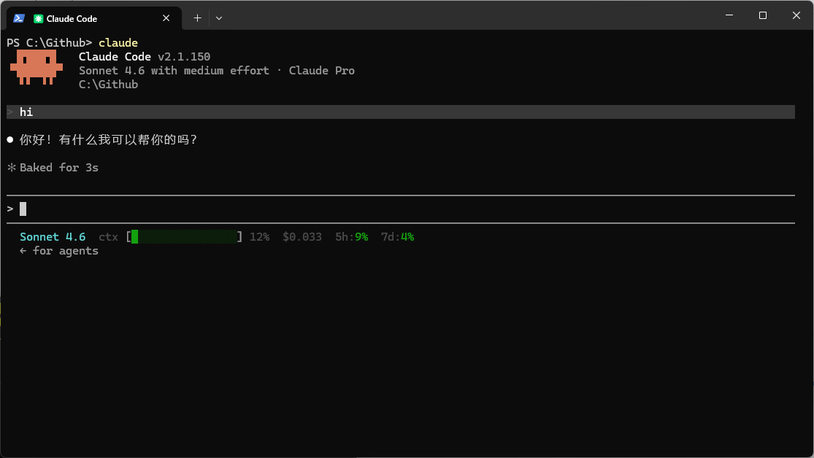
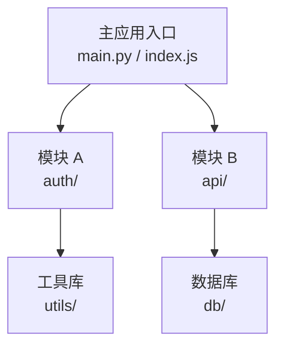

# Tyndall-Skills

精选的自定义 Claude Code 技能（SKILL.md 模板）和自动化脚本集合，旨在扩展 AI 能力并简化复杂的开发和生产力工作流程。

[English](README.md) | 中文

## 技能一览

| # | 技能 | 做什么 | 依赖 |
|:--:|---|---|---|
| 1 | [**状态栏伴侣**](#1-状态栏伴侣-statusline-buddy)<br>`statusline-buddy` | 自定义状态栏 —— 模型、上下文进度条、会话花费、速率限制 —— 外加完成提示音和一只活泼的金色卡皮巴拉 🐣 | Python 3 **或** Node |
| 2 | [**PDF 压缩器**](#2-pdf-压缩器-pdf-compressor)<br>`pdf-compressor` | 把超大 PDF 压到符合 API 限制，四档质量预设，自动备份原文件 | Ghostscript |
| 3 | [**PDF 图表提取器**](#3-pdf-图表提取器-pdf-figure-extractor)<br>`pdf-figure-extractor` | 用 TF-ID 模型检测并裁切论文里的图和表，附带 Markdown 索引 | Conda 环境 + Poppler |
| 4 | [**英文论文转中文 PDF**](#4-英文论文转中文-pdf-pdf-e2c)<br>`pdf-e2c` | 把英文论文重排成单栏中文 PDF，图/表/公式从原 PDF 高清裁切插回 | `pymupdf` `reportlab` `pillow` |
| 5 | [**视频字幕提取器**](#5-视频字幕提取器-video-subtitle-extractor)<br>`video-subtitle-extractor` | 从 YouTube / Bilibili 扒下字幕存成纯 `.txt` —— 只想要文字稿时用它 | `yt-dlp` |
| 6 | [**视频 + 双语字幕**](#6-视频下载与双语字幕-video-download)<br>`video-download` | 下载视频、拆掉滚动字幕并校对，打包成一个内嵌双语轨的 `.mkv` | `yt-dlp` `node` `ffmpeg` |
| 7 | [**项目架构摘要**](#7-项目架构摘要-project-summary)<br>`project-summary` | 读一个仓库（URL 或本地路径），生成 `architecture.md`，每张架构图都出两份 —— Mermaid 优先，ASCII 回退 | 无 |
| 8 | [**Claude 风格 HTML**](#8-claude-风格-html-claude-html)<br>`claude-html` | 把 Anthropic 的视觉语言做成可用的设计系统：两个模板、四类架构图、零 JavaScript | 无 |
| 9 | [**说人话**](#9-说人话-speak-human)<br>`speak-human` | 把术语重讲成：一句话结论 + 一个类比 + 一张 ASCII 图 + 一张术语对照表；也把「几个方案挑不下来」变成能拍板的样子 | 无 |
| 10 | [**Excalidraw 架构图**](#10-excalidraw-架构图生成-obsidian-excalidraw)<br>`obsidian-excalidraw` | 把文本变成 Obsidian 可直接打开的 Excalidraw 图，专攻 AI 模型架构（VLA、Transformer、Diffusion Policy） | Python 3 + Obsidian |
| 11 | [**论文快速总结**](#11-论文快速总结-paper-summary-simple)<br>`paper-summary-simple` | 给个标题或链接，返回一份开头就讲清「哪里值得借鉴」的中文摘要 | 无 |
| 12 | [**具身导航资料周报**](#12-具身导航资料周报-vln-feed)<br>`vln-feed` | 从 arXiv 和微信公众号增量收集 VLN / VLA / 具身导航新工作，去重入本地资料库，每周写成一份结构化中文研究周报 | Python 3（公众号另需 Docker） |

→ [如何将技能添加到 Claude Code](#如何将技能添加到-claude-code)

---

## 可用技能

### 1. 状态栏伴侣 (`statusline-buddy`)
跨平台的 Claude Code 增强技能，为 Windows 和 macOS 同时提供自定义状态栏与响应完成提示音。



- **触发条件：** “配置 Claude Code 状态栏”、”状态栏宠物”、”状态栏伴侣”、”Claude 回复完成后播放提示音”，或 bash/jq 状态栏脚本失败时使用。
- **核心功能：**
  - 显示模型名称、按用量上色的上下文进度条 `[████░░░░░░░░░░░░] 25%`、当前会话累计花费（美元）以及 5 小时 / 7 天速率限制百分比。
  - Claude 完成响应后自动播放提示音（叮咚 / 铃声 / 蜂鸣），macOS 使用 `afplay`，Windows 使用 PowerShell。
  - 颜色警告阈值可通过 `WARN_PCT` / `DANGER_PCT` 环境变量自定义（默认 70% / 85%）。
  - 自动检测 Python 或 Node.js —— 不依赖 `jq`，无 Unicode 编码错误。
  - **彩蛋宠物 🐣：** 状态栏行尾住着一只金色卡皮巴拉 —— 它会摆姿势（`\(^ww^)/` `~(-oo-)~`）、嚼东西、眨眼、单眼眨，并根据上下文用量 / 花费 / 速率限制在 **9 种心情**间轮换，每种心情都有自己的符号和短语池（`♥♥♥ chef's kiss` · `zZz /compact?` · `!?! everything is soup`）。它还会**随着你干活解锁颜色** —— 默认全金，当天所有窗口累计 API 工作时长越过 5 / 15 / 35 分钟后依次解锁彩色符号、彩色脸、整只流动彩虹。纯本地运行，**0 token 消耗**。
- **设置与前提条件：**
  - 系统 PATH 中需要 Python 3 或 Node.js。
  - 将该技能安装到 `~/.claude/skills/statusline-buddy/`（参见 [如何将技能添加到 Claude Code](#如何将技能添加到-claude-code)），然后对 Claude 说 **”帮我配置 Claude Code 状态栏”** —— 它会自动检测操作系统和运行时，询问提示音偏好，并完成脚本与 `settings.json` 的全部配置。

#### 🐣 认识你的宠物 —— 金色卡皮巴拉

状态栏行尾住着一只金色的小卡皮巴拉，移植自 Claude Code 内置的 companion 彩蛋。它只是一行文字，却是**活的**：每次状态栏刷新都会重新读取当前时间和会话状态，所以这小家伙会不停地摆姿势、不停地对你的状态碎碎念。

**它由四层拼成** —— 所以永远不会只剩一张干巴巴的脸杵在那：

```
\(^ww^)/  ♥♥♥  proud of you
│         │    └─ 话 —— 暗色，四帧里说三帧
│         └────── 符号 —— 每一帧都有，所以绝不会只剩一张脸
└──────────────── 姿势 + 脸 —— 举爪、泡水、咀嚼、眨眼、单眼眨
```

- **姿势** —— `\ /` 举爪、`/` 挥手、`~ ~` 泡在水里、`?` 歪头
- **脸** —— 眼睛跟着上下文用量走；嘴在 `oo → Oo → oO → ww → vv` 之间咀嚼，偶尔眨眼 `(-oo-)`、偶尔单眼眨 `(^oo-)`
- **符号** —— **每一帧都有**，所以它绝不会只剩一张脸
- **话** —— 四帧里说三帧，从当前心情的短语池按时间轮换

**眼睛**随上下文用量平滑变化：

| 上下文 | 眼睛 | 状态 |
|---|---|---|
| < 35% | `^` | 开心 —— `(^oo^)` / `(^ww^)` |
| 35% – WARN (70%) | `·` | 清醒 / 稳健 —— `(·oo·)` |
| WARN – DANGER (70%–85%) | `-` | 疲惫 —— `(-oo-)` |
| ≥ DANGER (85%) | `×` | 累瘫 —— `(×oo×)` |

**共 9 种心情** —— 会话状态优先挑一种，剩下的节拍由「日常心情」轮换填满：

| 心情 | 触发条件 | 符号 | 短语示例 |
|---|---|---|---|
| `alert` | 速率限额 ≥ 75% | `!!!` `! !` `!?!` | breathe, you ok? · go outside, i'll wait · hydrate maybe? |
| `fried` | ctx ≥ DANGER (85%) | `×××` `!?!` `@@@` | brain full, send help · /compact. please. · everything is soup |
| `sleepy` | ctx ≥ WARN (70%) | `zzz` `zZz` `- - -` | eyelids: heavy · /compact soon? · maybe wrap this one up |
| `rich` | 单会话花费 ≥ $1.50 | `$$$` `★★★` `$★$` | simply built different · capy has a corp card · wow. ok. luxury. |
| `cash` | 单会话花费 ≥ $0.30 | `$$$` `¢¢¢` | worth every cent · investing in ourselves · the tokens flow |
| `happy` | ctx < 35%（日常） | `♥♥♥` `✧✧✧` `♪♥♪` | you got this · chef's kiss · ship it, friend · big brain hours |
| `chill` | 日常轮换 | `♪♪♪` `. . .` `♪ ♪` | no thoughts, just grass · unbothered. moisturized. · floating along |
| `snack` | 日常轮换 | `*nom*` `*munch*` `°°°` | is that a tangerine? · one (1) melon please · grass o'clock |
| `silly` | 日常轮换 | `^_^` `:3` `owo` `>_<` | capybara.exe running · pro sitting expert · will work for melon |

- 普通状态心情（`sleepy` / `cash` / `rich`）占 3 帧里的 2 帧，剩 1 帧留给日常心情，免得看腻。
- **两个真·告警状态（`alert` / `fried`）独占每一帧** —— 该急的时候它不会跑偏去唱 "la la la~"。

所以你会时不时看到 `\(^ww^)/ ♥♥♥ proud of you`、`~(-oo-)~ zZz so sleepy` 或 `\(×oo×)/ !?! /compact pls` 这样的画面。

**颜色档位 —— 今天工作越久越花哨**

默认全金色。**跨窗口累计的当天 API 工作时长**越长，解锁的颜色层数越多：

| 今日 API 时长 | 档位 | 效果 | 对应实际工作量 |
|---|:--:|---|---|
| < 5 min | 1 | 全金色 —— `(^oo^) ♥♥♥` | 刚开工 / 轻量调试 |
| 5 – 15 min | 2 | **符号**按心情上色（开心粉、发呆蓝、零食橙…） | 约 30m~1h 深度结对，渐入佳境 |
| 15 – 35 min | 3 | **脸和符号**各自上色 —— 脸用淡色，符号用亮色 | 约 1.5h~3h 沉浸式编码，全情投入 |
| ≥ 35 min | 4 | **整只逐字符彩虹**，色相随秒数流动 | 全天重度编码 / 多 Agent 狂暴输出成就 🌈 |

- 统计的是所有窗口会话的 `cost.total_api_duration_ms` 累计，也就是**真正在跑 API 的时间** —— 挂着发呆不算数。
- 普通串行单次交互 API 耗时约 3~10 秒，因此 35 分钟 API 时长已代表极高强度的深度工作。
- 每个会话只知道自己的时长，所以跨会话累加存在 `~/.claude/statusline-buddy.json`（`{"date":…,"sessions":{"<session_id>":<ms>}}`），**每天 0 点自动重置**。
- 状态栏每次更新增量写盘，关闭或新建窗口不会丢失进度。
- 需要 256 色终端（Windows Terminal、iTerm2 以及基本所有现代终端都支持）。

| 环境变量 | 作用 |
|---|---|
| `BAR_WIDTH=16` | 上下文进度条格数（默认 16，最小 4，窄终端可调小） |
| `BAR_CELLS="█░"` | 进度条的填充 / 空白字符（恰好两个字符；若你的终端上进度条宽度会变，改成 `"▮▯"`） |
| `BUDDY_TIERS="5,15,35"` | 自定义解锁档 2/3/4 的分钟阈值（默认: 5, 15, 35） |
| `BUDDY_TIER=4` | 强制锁定某档用于预览（不写状态文件） |
| `BUDDY_NOW=<整数>` | 固定动画相位，方便逐帧调试 |

**技术原理**
- **0 token，纯本地** —— 它由状态栏脚本本地计算、画在你的终端里，**任何内容都不会发给模型**。
- 符号加粗醒目，话语用暗色柔和呈现，不抢状态栏其它信息。
- 想换台词？编辑 `statusline.py` / `statusline.js` 里的 `MOODS` 表 —— 每种心情的 `pose` / `sym` / `says` 三个列表都能随便加。两条约定：短语控制在 24 字符内 —— 话在最右边，是窄终端第一个截掉的东西；`pose` 和 `sym` 别用同一批字符，否则会糊成 `zZ z Z z` 这种。
- 容错设计 —— 一旦出错宠物就静默隐藏，状态栏其余部分完全不受影响；状态文件读不到或写不进时静默退回档 1（全金）。

### 2. PDF 压缩器 (`pdf-compressor`)
使用 Ghostscript 自动压缩大型 PDF 文件，确保它们符合 API 限制或优化处理速度。

- **触发条件：** “压缩 report.pdf”、“减小 PDF 大小”，或在文件 > 10MB 时自动激活。
- **核心功能：** 
  - 多种质量预设（`screen`、`ebook`、`printer`、`prepress`）。
  - 自动备份原始文件。
  - 针对包含大量图像的文档显著减小体积。
- **设置与前提条件：**
  - **依赖项：** [Ghostscript](https://ghostscript.com/releases/gsdnld.html)。
  - 确保 `gswin64c` (Windows) 或 `gs` (Linux/macOS) 已添加到系统 PATH。

### 3. PDF 图表提取器 (`pdf-figure-extractor`)
使用 [TF-ID](https://github.com/ai8hyf/TF-ID)（基于 Florence2）目标检测模型从 PDF 文档中提取图表和表格。

- **触发条件：** “提取此 PDF 中的所有图表”、“获取 paper.pdf 中的表格”。
- **核心功能：**
  - 高精度检测学术论文布局元素。
  - 输出裁剪后的图像和 Markdown 索引，方便查看。
  - 支持特定页码范围提取。
- **设置与前提条件：**
  1. **安装 Poppler：**
     - **Windows：** 从 [poppler-windows](https://github.com/oschwartz10612/poppler-windows/releases) 下载并将 `bin` 文件夹添加到系统 PATH。
     - **macOS：** `brew install poppler`
     - **Linux：** `sudo apt-get install poppler-utils`
  2. **创建 Conda 环境：**
     ```bash
     conda create -n TF-ID python=3.10 -y
     conda activate TF-ID
     pip install torch torchvision transformers timm einops pillow opencv-python pdf2image accelerate
     ```

### 4. 英文论文转中文 PDF (`pdf-e2c`)
把英文论文转成排版干净的中文版 PDF —— 重排为单栏自由流式，图、表、公式全部从原 PDF 高清裁切后插回对应位置附近。

- **触发条件：** “把这篇论文转成中文”、“英文论文转中文版”、“translate this paper to Chinese pdf”。
- **核心功能：**
  - **刻意不保留原版式** —— 中英文占用空间差异大，硬塞进原双栏框架只会挤成一团，所以重排为单栏。
  - 图 / 表 / 公式是原 PDF 的像素级裁切（“用原图”），不重绘、不重新渲染。
  - 正文、标题、图注全部翻译为中文；参考文献按惯例保留英文。
  - 翻译和版面决策由 Claude 完成，脚本只负责机械的提取 → 裁切 → 排版。
- **设置与前提条件：**
  - `pip install pymupdf reportlab pillow`
  - 中文字体使用 reportlab 内置 CID 字体 `STSong-Light`，无需安装字体文件。

### 5. 视频字幕提取器 (`video-subtitle-extractor`)
从 Bilibili 和 YouTube 视频中提取字幕并保存为纯 `.txt` 文件。

- **触发条件：** “从这个 YouTube 链接提取字幕：[URL]”、“获取 Bilibili 视频的字幕”。
- **核心功能：**
  - 支持 Bilibili 和 YouTube。
  - 智能语言优先级（默认为中文/英文）。
  - 通过 `cookies.txt` 支持登录限制视频。
- **设置与前提条件：**
  - **依赖项：** `pip install yt-dlp`。
  - **Cookie 设置（可选）：** 若要提取需登录或大会员可见的视频字幕：
    1. 使用浏览器扩展（如“Get cookies.txt LOCALLY”）导出你的 Cookie。
    2. 将下载好的 Cookie 文件直接放入 `video-subtitle-extractor/cookies` 文件夹即可（无需改名）。
  - 确保 `yt-dlp` 在你的环境中可以访问。

### 6. 视频下载与双语字幕 (`video-download`)
下载视频本体、重建字幕，并打包成一个内嵌双语字幕轨的 `.mkv`，同时把 `.srt` 留在旁边方便继续编辑和检索。它是 `video-subtitle-extractor` 的搭档：那个给你可读的文字稿，这个给你能看的片子。

- **触发条件：** “下载视频”、“双语字幕”、“校对字幕”，通常伴随一个 YouTube / Bilibili 链接。
- **核心功能：**
  - **拆掉滚动字幕。** 自动字幕每一条都重复上一条再追加一行，中间用 10ms 的填充条撑着 —— 18 分钟的演讲会变成约 980 条字幕、实际只有约 490 行内容，直接播放就是不停闪烁的重复文字。这一步把时间轴重建干净。
  - **先校对听错的词，再看中文。** 机翻是“忠实”的 —— 它忠实地翻译了语音识别听错的东西：`LLMs` 听成 `Hums`，中文就成了「哼唱」；`agentic` 听成 `a gentic`，就成了「基因」。所以英文校对必须跑在中文之前，否则就是垃圾进垃圾出。
  - 技术术语保留英文（`agent`、`prompt`、`PR`、`token`、库名），只翻译有公认中文译法的概念。
  - 昂贵的校对环节会先问你 —— 拒绝的话仍然会得到拆好的字幕和 `.mkv`，只是里面是未经校对的机翻。
  - 用 `-c copy` 封装：不转码、无画质损失，中文轨默认开启。
- **设置与前提条件：** PATH 中需要 `yt-dlp`（`pip install yt-dlp`）、`node` 和 `ffmpeg`。登录限制视频的 Cookie 配置方式与 `video-subtitle-extractor` 相同 —— 两个技能共用同一个 cookies 文件夹。

### 7. 项目架构摘要 (`project-summary`)
分析 GitHub 项目（远程仓库 URL 或本地路径），自动生成中文版 `architecture.md`。每张架构图都出两份：Mermaid 版在 GitHub / VS Code / Obsidian 里直接渲染，ASCII 版负责纯终端、PR diff，以及 Mermaid 表达不了的精细对齐。

- **触发条件：** “分析这个 GitHub 项目”、“生成 architecture.md”、“总结项目结构”。
- **核心功能：**
  - 通过决策树自动选择架构图的**语义**（线性流水线 / 分层架构 / 模块依赖树 / 微服务交互 / 请求处理流 / 嵌套组件 / 张量维度流），再用两种语法把同一套语义各画一遍。
  - **Mermaid 优先 + ASCII 回退**：两张图必须表达同一套节点和边。默认纵向 `flowchart TD` —— 5 个以上节点硬用 `LR` 会被拉得很宽，每个框的字都看不清。
  - **Mermaid 语法安全准则**，避免一处写错整图渲染失败：节点标签一律加双引号、禁止裸 `<` `>` `|`、`<image>` 这类 token 要先改写再进图。
  - **Pattern 7 张量维度流图**，专供 ML/深度学习仓库（torch / transformers 依赖，`model/` `policy/` `networks/` 目录）：每个核心模型单独画一张，叠在整体架构图之上，附维度核验清单。
  - ASCII 图宽度自适应（80 / 120 列），并处理中英文字符双倍宽对齐。
  - 输出结构化的 `architecture.md`，涵盖技术栈、核心组件、数据流与关键设计决策。
- **设置与前提条件：** 无 —— 仅使用 Claude Code 内置的文件与 Shell 工具。
- **示例输出（节选）** —— 同一套架构，两种画法：

  **架构总览（Mermaid）**


```mermaid
flowchart TD
    APP["主应用入口<br/>main.py / index.js"]
    A["模块 A<br/>auth/"]
    B["模块 B<br/>api/"]
    U["工具库<br/>utils/"]
    D["数据库<br/>db/"]

    APP --> A
    APP --> B
    A --> U
    B --> D
```

  **架构总览（文本细化版）**

  ```
  ┌─────────────────────────────────────┐
  │            主应用入口                │
  │           main.py / index.js         │
  └──────┬──────────────┬───────────────┘
         │              │
         ▼              ▼
  ┌──────────┐    ┌──────────┐
  │  模块 A  │    │  模块 B  │
  │  auth/   │    │  api/    │
  └────┬─────┘    └────┬─────┘
       │               │
       ▼               ▼
  ┌──────────┐    ┌──────────┐
  │  工具库  │    │  数据库  │
  │  utils/  │    │   db/    │
  └──────────┘    └──────────┘
  ```

### 8. Claude 风格 HTML (`claude-html`)
一套完整的设计系统，用 Anthropic / Claude 的克制视觉语言产出 HTML —— 象牙暖底、陶土橙（`#D97757`）点缀、零 JavaScript，明暗双主题开箱即用。

- **触发条件：** “做个 HTML 报告 / 复盘 / 看板”、“Claude 风格”、“Anthropic 风格”、“简约风格”，或把已有页面改造成这套风格。
- **核心功能：**
  - **两个可直接在浏览器打开的模板：** `project.html`（项目架构 + 工作进度）和 `starter.html`（数据报告 / 复盘）—— 改内容远比从零写快。
  - **内置四类架构图** —— 系统管线、模型分层、模块依赖、训练闭环，并规定了图上到底该标什么（频率、延迟、参数量、张量维度、真实 topic 与模块名）。
  - **零 JavaScript。** 交互一律用纯 CSS 方案（radio / checkbox / details），图表一律内联 SVG —— 所以它在 artifact、邮件客户端、离线存档这些会剥掉 JS 的环境里照样能看。
  - **有主张的风格铁律**，防止它滑向千篇一律的 AI 审美：陶土橙只做点缀绝不做主色，状态色用土色系，边框 1px、几乎不用阴影，靠留白而非线条做分隔。
  - 可选的 `harvest_openspec.py` 能把 OpenSpec 项目里的近期变更收割成 `progress.json`，直接喂给进度看板。
- **设置与前提条件：** HTML 本身零依赖。OpenSpec 收割脚本需要 Python 3 和一个用 OpenSpec 管理的项目。

### 9. 说人话 (`speak-human`)
把满是术语的内容重新讲一遍 —— 一句话结论、一个从头贯穿到尾的生活化类比、一张 ASCII 图、落回你这件事具体要干嘛，外加一张术语对照表。只换说法，不换意思。

- **触发条件：** “说人话”、“讲人话”、“听不懂”、“太专业了”、“用大白话解释”，或用 `/speak-human` 让它重讲上一条回复。也可以直接翻译粘贴进来的报错、技术文档、论文段落、合同条款 —— 以及 AI 抛回来、你不敢选的那几个方案。
- **核心功能：**
  - **固定五块输出结构**，确保关键部分不会被省掉 —— 尤其是「具体到你这件事」那一块，没有它，比方就是悬空的，用户看完还是不知道该干嘛。
  - **裁决场景单独一套结构。** 球被踢回给你时（「这三种做法你倾向哪个？」），把选项重念一遍没有用。这一档会先讲清你到底在拍哪块板，再按**你真正在乎的问题**（而不是参数名）把选项横着摆开，并标出哪几条路掉头回不来。
  - **三档难度**，说「还是不懂」就降档并换一个新类比，说「不用这么啰嗦」就升档。
  - 语言硬规矩：英文缩写不许裸奔、一句话只说一件事且不超过 30 字、数字必须给参照物（`300 毫秒` → “大概眨一次眼”）、禁用书面腔。
  - **准确性优先于简单** —— 前提、限制、风险一个都不能因为「简化」被删掉，类比失真的地方必须自己说明。
  - 十种 ASCII 图模板（流程、分层、前后对比、闭环、时间线、占比、包含、取舍、**选项对比**、**决策树**），中文字宽对齐的坑已经处理好；另附一张选型表，把「原文里有什么」直接映射到「画哪张图」，也告诉你什么时候别画。
- **设置与前提条件：** 无。

### 10. Excalidraw 架构图生成 (`obsidian-excalidraw`)
把文本内容生成为 Obsidian 可直接打开的 Excalidraw `.md` 图，重点优化了 AI 模型架构图 —— VLA、Transformer、Diffusion Policy、多系统管线。

- **触发条件：** “画图”、“架构图”、“模型结构”、“流程图”、“思维导图”、“Excalidraw”、“diagram”。
- **核心功能：**
  - **用 `Builder` 类代替手写 JSON** —— 七个 helper（`rect` / `text` / `arrow` / `ellipse` / `subbox` / `parent_box` / `module`）替你处理索引分配、元素双向绑定和序列化。
  - **写入前自动跑 7 项 sanity check**，覆盖 Excalidraw 文件格式里所有已知踩坑点。
  - 面向架构图的约定：每次维度变化都标注张量形状，前向过程从左到右、层级关系从上到下，支持子系统分组（System 1/2、训练/推理、感知/动作）。
  - 附带配色字典和一份 AI 架构图范式参考库。
- **设置与前提条件：** 运行 builder 需要 Python 3。查看和编辑结果需要 Obsidian + Excalidraw 插件。

---

### 11. 论文快速总结 (`paper-summary-simple`)
丢一个论文标题或一条链接进去，拿回一份结构化中文摘要。不下 PDF、不抽图，全靠网页信息 —— 正因为轻，才能拿来扫一整份阅读清单。

- **触发条件：** “总结这篇论文”、“summarize this paper”，或者直接粘一条 arXiv / OpenReview / 会议链接。
- **核心功能：**
  - **开头就是「精华」** —— 最多五句话讲清这篇论文哪里值得借鉴，放在所有背景介绍之前。扫这一段就能决定要不要继续读。
  - **固定五段结构**（精华 → 背景 → 方法 → 结果 → 局限），且故意分配不均：方法部分承载细节，背景和局限各自压在 2-3 句。
  - **中文行文，术语保英文** —— 模型名、数据集、指标和术语（VLM、VLN、Transformer、RL）一律留原文，以后还搜得到。
  - **不臆测 venue。** 抓到的页面没写发表处，就按预印本处理，而不是猜一个会议名字填上。
  - **输出能直接发出去**：图片占位写法避开了 kramdown 的坑（`<div>` 内不能有空行、只用 ASCII 直引号），另附一份 MathJax 转义指南，专治 Jekyll 默默吃掉公式的那几种写法。
- **设置与前提条件：** 无 —— 能联网就行。图本身需要抽的话，配合 [`pdf-figure-extractor`](#3-pdf-图表提取器-pdf-figure-extractor) 用。

### 12. 具身导航资料周报 (`vln-feed`)
把具身导航领域（VLN、VLA、视觉导航、具身 Agent）的新工作从 arXiv 和微信公众号收进一个本地增量资料库，再把每周新增写成一份结构化中文研究周报。它服务的是做地面机器人 VLN 研究、想知道「这周该读哪几篇」的人，不是资讯搬运。

- **触发条件：** “抓取具身导航最新资料”、“更新 VLN 选题库”、“分析最近 VLN/VLA 论文”、“生成 VLN 周报”、“vln-feed”。
- **核心功能：**
  - **增量去重的资料库** —— 每条一份 Markdown，外加一张 `index.md` 总索引；重复跑只补新条目。每条自动标注**领域**（导航 / 具身Agent / VLA·操作 / 自动驾驶 / 其他）和它报告的**基准**（R2R-CE、RxR-CE、ObjectNav、HM3D……），筛选只需对一个字段 `grep`。
  - **两条调过噪声的 arXiv 检索** —— 导航一条、具身 Agent / AgentOS 一条，`feeds.yaml` 里逐条注释了噪声怎么实测、怎么收窄的。arXiv API 高负载时会对未缓存检索返回 `406`，这时自动改走 OAI-PMH 拉全量元数据，在本地用同一条检索式匹配。
  - **导航深读，其余速览。** 一周的 arXiv 结果里纯操作类 VLA 论文可能占到四分之三，所以周报只对「导航 + 具身Agent」主池做深度分析（问题 / 方法 / 证据 / 价值 / 局限），其余按主题压成一行一组。R2R-CE（连续环境）和离散 R2R 绝不混写。
  - **证据纪律** —— 「论文报告……」与「本报告判断……」分开写，链接只取自已抓条目、不凭记忆补，不用宣传措辞。`validate_report.py` 会拦下缺核心章节、带图片、带表格（手机上难读）或带裸链接的报告。
  - **公众号接入如实交代** —— 手动喂文章链接始终可用；自建 `we-mp-rss` 的链路已经搭好，但微信的账号级频控可能一卡几周。`probe_wechat.py` 5 秒内告诉你当前处在哪种状态。
- **设置与前提条件：**
  - `pip install -r vln-feed/requirements.txt`（Python 3）。arXiv 源开箱即用。
  - 资料库默认写到 `vln-feed/output/`；想放别处就改 `feeds.yaml` 的 `output_dir`。
  - 公众号（可选）：需要 Docker，外加一个你自己的微信公众号（免费的个人订阅号即可）给 `we-mp-rss` 扫码授权。首次启动前先改掉 `we-mp-rss/docker-compose.yml` 里的 `PASSWORD`。

---

## 如何将技能添加到 Claude Code

有三种方式让 Claude Code “学习”这些技能，挑最方便的即可。

### 选项 A：直接把链接丢给 Claude（最推荐，最省事）
最省事的方式：把本仓库链接粘贴给 Claude Code，剩下的交给它 —— 它会自己读取仓库、找到你需要的技能，并帮你安装或直接运行，无需手动复制、无需折腾路径。
> “这是一个技能仓库：https://github.com/TingdeLiu/Tyndall-Skills —— 帮我安装其中的 `statusline-buddy` 状态栏技能。”

### 选项 B：全局注册
将技能文件夹复制到本地 Claude Code 技能目录。这使得该技能在你所有的项目中都可用。
```bash
# Windows (将 'skill-folder-name' 替换为例如 'pdf-compressor')
xcopy /E /I .\skill-folder-name %USERPROFILE%\.claude\skills\skill-folder-name

# macOS/Linux
cp -r ./skill-folder-name ~/.claude/skills/
```

### 选项 C：上下文引用
如果你不想全局安装它们，只需在对话中引用 `SKILL.md` 文件：
> “请根据 @pdf-compressor/SKILL.md 帮我压缩这个文件”

---
*由 [Tingde Liu](https://github.com/TingdeLiu) 创建并维护。*
