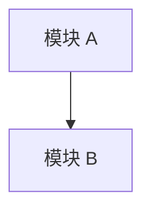
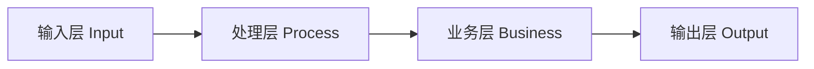
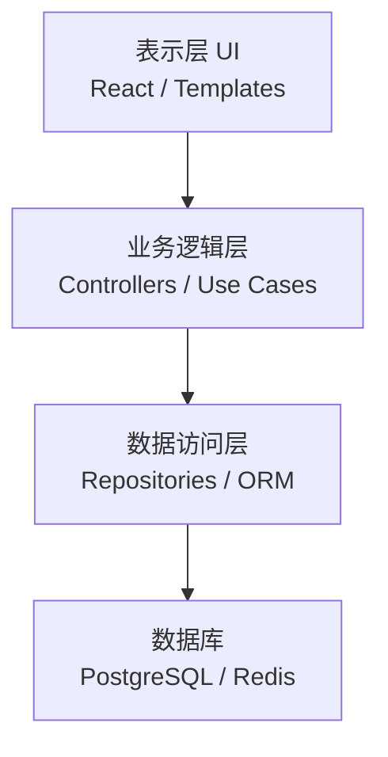
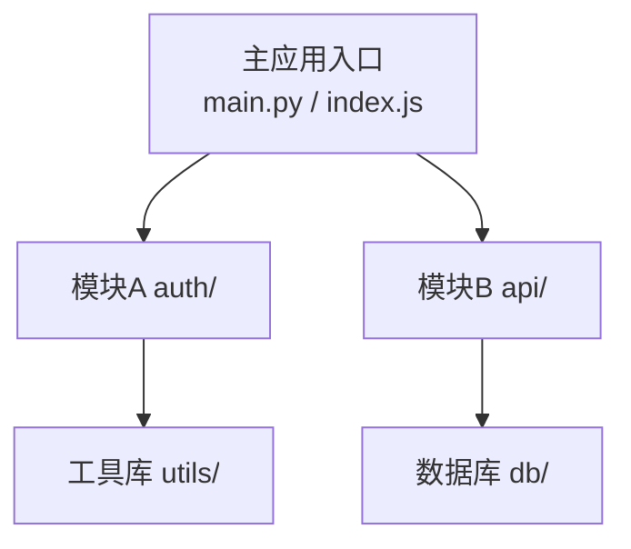
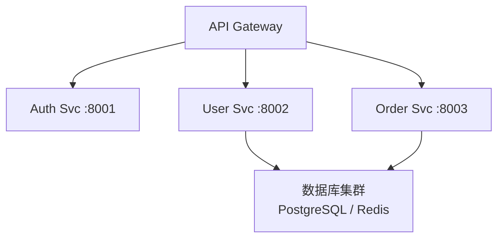
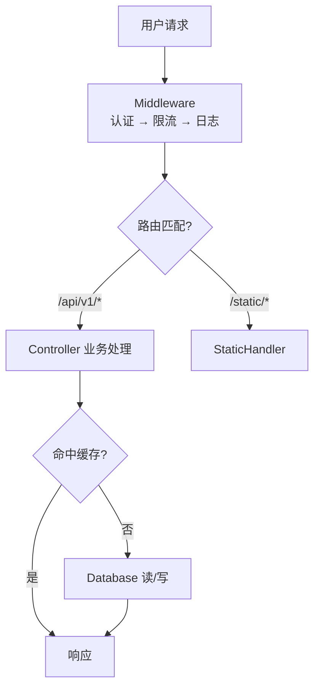
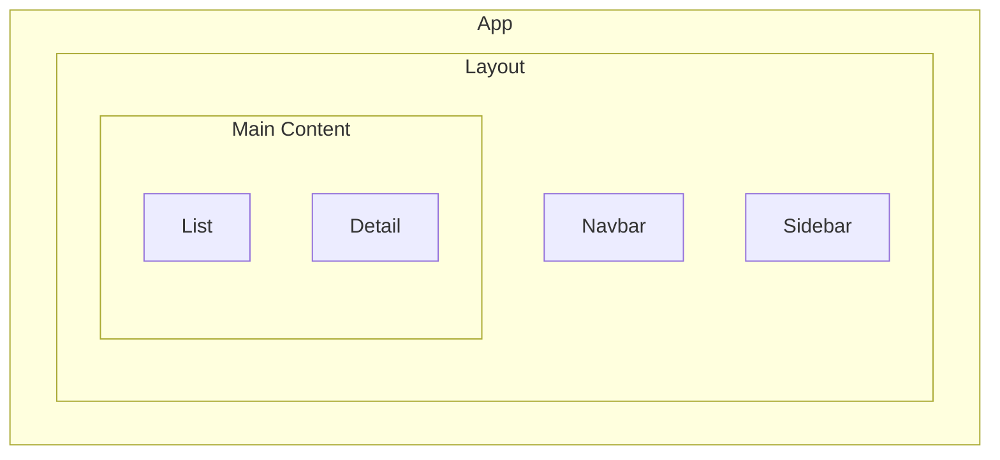
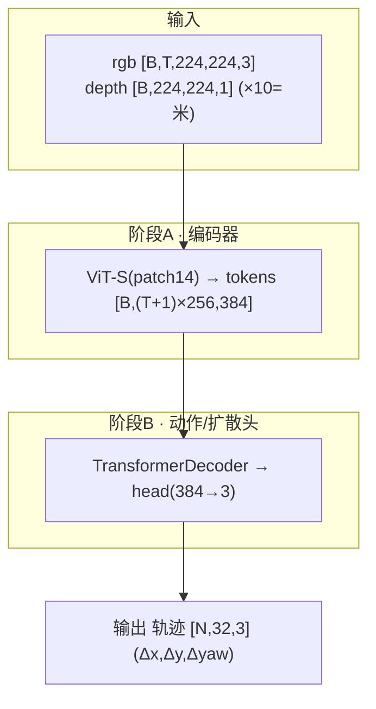

# Project Summary

## Overview

This skill helps analyze GitHub projects and generate a comprehensive `architecture.md` file that documents the project's structure, key components, file purposes, and architectural decisions.

## Workflow

### Step 1: Gather Project Information

Before analyzing, collect the necessary information:

1. **Get the GitHub repository URL or local path**
   - If URL is provided, use web scraping to fetch README and repository structure
   - If local path is provided, use bash tools to explore the directory

2. **Identify the project type**
   - Detect programming language(s) from file extensions
   - Identify frameworks (React, Django, Flask, etc.)
   - Determine build tools (package.json, requirements.txt, Cargo.toml, etc.)

### Step 2: Analyze Project Structure

Systematically explore and document the project:

1. **Map the directory structure**
   ```bash
   # Get high-level directory tree
   tree -L 3 -I 'node_modules|__pycache__|.git|dist|build'
   ```

2. **Identify key directories and their purposes**
   - `/src` or `/app` - Main source code
   - `/tests` or `/test` - Test files
   - `/docs` - Documentation
   - `/config` - Configuration files
   - `/public` or `/static` - Static assets
   - `/scripts` - Build/deployment scripts

3. **Catalog important files**
   - Configuration files (package.json, setup.py, Cargo.toml, etc.)
   - Entry points (main.py, index.js, main.rs, etc.)
   - Documentation (README.md, CONTRIBUTING.md, etc.)

### Step 3: Analyze Code Architecture

Examine the codebase systematically:

1. **Identify architectural patterns**
   - MVC, MVVM, microservices, monolithic, etc.
   - Component structure (for frontend projects)
   - Module organization (for backend projects)

2. **Document key components**
   - Core modules and their responsibilities
   - API endpoints or routes
   - Database models or schemas
   - Service layers
   - Utility functions

3. **Map dependencies and relationships**
   - Internal module dependencies
   - External library usage
   - Data flow between components

### Step 4: Generate Architecture Diagrams (Mermaid 优先 + ASCII 回退)

**IMPORTANT: 每张架构图都用「Mermaid 优先、ASCII 回退」双图输出。先用决策树（下方）选定图形语义，
再用同一语义同时产出 Mermaid 图（首选，GitHub/VS Code/Obsidian 可直接渲染）和 ASCII 图（文本细化版/
无渲染环境回退）。决策树只决定"画哪种结构"，不决定"用哪种语法"——两种语法都要输出。**

#### 4.0 Auto-Select Diagram Style (Decision Tree)

Run through these checks **in order** after Step 2–3 analysis. Use the **first matching** pattern:

```
项目分析结果
│
├─ ML/深度学习模型项目? (torch/transformers 依赖 + model/ policy/
│   networks/ 目录, 或训练/推理脚本)
│   └─▶ Pattern 7: 张量维度流图（叠加在整体架构图之上，
│        每个核心模型单独画一张，附维度核验清单）
│
├─ 存在 docker-compose.yml / kubernetes/ / 多个独立 service 目录?
│   └─▶ Pattern 4: 微服务交互图
│
├─ 存在 DAG / pipeline / workflow / etl / airflow / prefect 关键词?
│   └─▶ Pattern 1: 线性处理流水线
│
├─ 存在 components/ / pages/ / views/ (前端框架特征)?
│   ├─ 嵌套层级 ≥ 3 层?  └─▶ Pattern 6: 嵌套组件架构
│   └─ 否则           └─▶ Pattern 3: 模块依赖树
│
├─ 存在明显中间件链 (middleware/ / interceptor / filter / handler)?
│   └─▶ Pattern 5: 请求处理流水线
│
├─ 存在清晰分层目录 (controllers/ + services/ + models/ / repositories/)?
│   └─▶ Pattern 2: 垂直分层架构
│
└─ 以上均不明显?
    └─▶ Pattern 3: 模块依赖树 (最通用兜底)
```

**复合项目**（如全栈）：后端用 Pattern 2 或 5，前端用 Pattern 6，**分开画两张图**。

#### 4.1 Mermaid 优先 + ASCII 回退（双图输出约定）

每个需要图的章节（架构总览 / 处理流水线 / 核心模型详解的鸟瞰总图），**先输出 Mermaid，再输出 ASCII**，
各自加一行粗体小标题区分：

````markdown
**架构总览（Mermaid）**



**架构总览（文本细化版）**

```
┌────────┐     ┌────────┐
│ 模块 A │────▶│ 模块 B │
└────────┘     └────────┘
```
````

约定要点：
- **Mermaid 在前、ASCII 在后**：Mermaid 是首选展示形态；ASCII 是无渲染环境（纯终端、PR diff）的回退，
  同时承载 Mermaid 不便表达的精细对齐（如 Pattern 7 的 ═ 阶段分隔）。
- **语义一致**：两张图必须表达同一套节点、边、方向、分支——不能一张多画一个模块。
- **方向选择（默认 `flowchart TD` 纵向）**：**优先纵向 TD**——纵向图在 GitHub/文档里更易读，节点不会被
  压扁。只有当链条**极短（≤3~4 个节点）且无分支**时才考虑 `flowchart LR`（横向）。
  > ⚠️ 已知坑：把 5+ 节点的单步闭环画成 `flowchart LR`，渲染会被拉得很宽、每个框很小、文字看不清。
  > 单步闭环 / 处理流水线即便"概念上是横向流"，也用 `flowchart TD`，末尾用反向边
  > （`STEP -->|"下一步观测"| OBS`）表达回环即可，不要为了"横着走"硬用 LR。
- **ML 项目的 Pattern 7 鸟瞰总图**：Mermaid 用 `subgraph` 表示每个"阶段"，shape 写进节点标签；
  ASCII 仍用 ═ 分隔阶段的文本细化版（两者并存，信息互补）。

#### 4.2 Mermaid 语法安全准则（避免渲染失败）

Mermaid 对特殊字符敏感，**务必逐条遵守**，否则整图渲染失败：

1. **所有节点标签加双引号**：`A["文本 + [B,5,2]"]`、判定用菱形 `D{"条件 ?"}`。引号内可安全包含
   `[ ]`、`( )`、`:`、`?`、`/`、`×`、`→`、`‖` 等字符。
2. **禁止裸 `<` `>` `|`**：会被当成 HTML 标签或边语法。特殊 token 如 `<|NAV|>`、`<image>` 要改写为
   纯文字（如 `NAV特殊token`、`image占位`），完整原形放进正文或 ASCII 版。
3. **换行用 `<br/>`**：节点内多行写成 `A["第一行<br/>第二行"]`。
4. **边标签也加引号**：`A -->|"是"| B`、`A -->|"输出 checkpoint"| B`。
5. **节点 id 用 ASCII**（`A`/`M1`/`HS`），中文只放进标签文本；id 不要和 `subgraph` id 重名。
6. **循环/反馈用反向边**：`STEP -->|"下一步观测"| OBS`、`LOOP --> SPIN`，表达闭环。
7. **生成后自检**：括号配对、每个 `subgraph` 都有 `end`、箭头 `-->` 完整、无裸特殊字符。

#### 4.3 各 Pattern 的 Mermaid 模板

按 4.0 选中的 Pattern，套用对应 Mermaid 骨架（再补 ASCII 文本细化版）：

**Pattern 1 线性流水线** → `flowchart LR`


**Pattern 2 垂直分层** → `flowchart TD`（自顶向下分层，可用 subgraph 包裹每层）


**Pattern 3 模块依赖树** → `flowchart TD`


**Pattern 4 微服务交互** → `flowchart TD`（网关扇出）


**Pattern 5 请求处理流水线（带分支）** → `flowchart TD` + 菱形判定


**Pattern 6 嵌套组件** → `flowchart TD` + 嵌套 `subgraph`


**Pattern 7 张量维度流图** → `flowchart TD` + 每个阶段一个 `subgraph`，shape 写进节点

> Pattern 7 的 Mermaid 给"阶段级鸟瞰"，**ASCII 文本细化版仍必画**（承载逐层 shape 与 ═ 阶段分隔、
> 维度核验注释）。两者并存。

#### 4.4 Width Adaptation（宽度自适应，仅用于 ASCII 回退图）

> 以下宽度/对齐规则**只针对 ASCII 文本细化版**；Mermaid 由渲染器自动布局，无需手算宽度。

在生成 ASCII 图前，**先确定目标宽度**：

| 场景 | 目标宽度 | 说明 |
|------|----------|------|
| 默认（未指定） | **80 列** | 兼容所有终端和 GitHub PR 预览 |
| 用户指定 `--wide` 或宽屏 | **120 列** | 允许更多节点并排 |
| 简单项目（≤5 个模块） | **60 列** | 避免空白过多 |

**宽度控制规则：**

```
每个 box 的宽度 = ceil(最长标签字符数 / 2) * 2 + 4   (含边框，保持偶数)

水平 Pattern 1 节点数上限:
  80 列模式:  最多 4 个节点并排  (每节点 ~14 列 + 5 列箭头)
  120 列模式: 最多 6 个节点并排

超出节点数时，折行处理:
  ┌──────┐     ┌──────┐     ┌──────┐
  │  A   │────▶│  B   │────▶│  C   │
  └──────┘     └──────┘     └──┬───┘
                               │
               ┌──────┐        ▼
               │  E   │◀───┌──────┐
               └──────┘    │  D   │
                           └──────┘
```

**中英文混排对齐规则（中文字符占 2 列）：**

```python
# 计算可见宽度（用于对齐 padding）
def visual_width(s):
    return sum(2 if '\u4e00' <= c <= '\u9fff' else 1 for c in s)

# box 内标签居中
def center_label(label, box_inner_width):
    vw = visual_width(label)
    pad = box_inner_width - vw
    return ' ' * (pad // 2) + label + ' ' * (pad - pad // 2)
```

生成时按此逻辑心算或手工校对，确保框内文字视觉居中。

#### ASCII Diagram Style Reference

Use these box-drawing character sets:

| 用途 | 字符集 |
|------|--------|
| 普通模块框 | `┌─┐ │ └─┘` |
| 强调/顶层框 | `╔═╗ ║ ╚═╝` |
| 虚线/可选框 | `┌╌╌┐ ╎ └╌╌┘` |
| 箭头 | `──▶  ──▷  ←──  │  ▼  ▲` |
| 分支/汇合 | `├──  └──  ┬  ┴  ┼` |

#### Pattern 1: 线性处理流水线（水平）

For sequential data/request processing pipelines:

```
┌──────────┐     ┌──────────┐     ┌──────────┐     ┌──────────┐
│  输入层  │────▶│  处理层  │────▶│  业务层  │────▶│  输出层  │
│  Input   │     │ Process  │     │ Business │     │  Output  │
└──────────┘     └──────────┘     └──────────┘     └──────────┘
```

#### Pattern 2: 垂直分层架构

For layered/tiered system architecture:

```
╔══════════════════════════════════════╗
║           表示层 (UI Layer)          ║
║     React Components / Templates     ║
╠══════════════════════════════════════╣
║         业务逻辑层 (Service Layer)   ║
║      Controllers / Use Cases         ║
╠══════════════════════════════════════╣
║         数据访问层 (Data Layer)      ║
║       Repositories / ORM Models      ║
╠══════════════════════════════════════╣
║           数据库 (Database)          ║
║         PostgreSQL / Redis           ║
╚══════════════════════════════════════╝
```

#### Pattern 3: 模块依赖图（树形）

For showing module/component dependencies:

```
┌─────────────────────────────────────┐
│              主应用入口              │
│            main.py / index.js        │
└──────┬──────────────┬───────────────┘
       │              │
       ▼              ▼
┌──────────┐    ┌──────────┐
│  模块 A  │    │  模块 B  │
│  auth/   │    │  api/    │
└────┬─────┘    └────┬─────┘
     │               │
     ▼               ▼
┌──────────┐    ┌──────────┐
│  工具库  │    │  数据库  │
│  utils/  │    │   db/    │
└──────────┘    └──────────┘
```

#### Pattern 4: 微服务/组件交互图

For distributed systems or service interactions:

```
           ┌─────────────────┐
           │   API Gateway   │
           └────────┬────────┘
          ┌─────────┼─────────┐
          │         │         │
          ▼         ▼         ▼
   ┌──────────┐ ┌────────┐ ┌────────┐
   │ Auth Svc │ │User Svc│ │ Order  │
   │  :8001   │ │ :8002  │ │  Svc   │
   └──────────┘ └────┬───┘ │ :8003  │
                     │     └───┬────┘
                     ▼         ▼
              ┌──────────────────┐
              │     数据库集群    │
              │  PostgreSQL/Redis │
              └──────────────────┘
```

#### Pattern 5: 请求处理流水线（带注释）

For detailed request/data flow with annotations:

```
用户请求
    │
    ▼
┌───────────────────────────────────────┐
│              Middleware                │
│  [认证] ──▶ [限流] ──▶ [日志记录]    │
└───────────────────┬───────────────────┘
                    │
                    ▼
┌───────────────────────────────────────┐
│               Router                  │
│  /api/v1/* ──▶ APIHandler             │
│  /static/*  ──▶ StaticHandler         │
└───────────────────┬───────────────────┘
                    │
          ┌─────────┴──────────┐
          ▼                    ▼
   ┌─────────────┐    ┌──────────────┐
   │  Controller │    │    Cache     │
   │  (业务处理) │    │   (Redis)    │
   └──────┬──────┘    └──────────────┘
          │
          ▼
   ┌─────────────┐
   │   Database  │
   │  (读/写分离) │
   └─────────────┘
```

#### Pattern 6: 嵌套组件架构

For frontend component hierarchies or nested modules:

```
┌────────────────────────────────────────┐
│                 App                    │
│  ┌──────────────────────────────────┐  │
│  │            Layout                │  │
│  │  ┌──────────┐  ┌──────────────┐  │  │
│  │  │  Navbar  │  │   Sidebar    │  │  │
│  │  └──────────┘  └──────────────┘  │  │
│  │  ┌──────────────────────────────┐ │  │
│  │  │          Main Content        │ │  │
│  │  │  ┌────────┐  ┌────────────┐ │ │  │
│  │  │  │ List   │  │   Detail   │ │ │  │
│  │  │  └────────┘  └────────────┘ │ │  │
│  │  └──────────────────────────────┘ │  │
│  └──────────────────────────────────┘  │
└────────────────────────────────────────┘
```

#### Pattern 7: 张量维度流图（ML/深度学习模型项目）

For neural network models: document **input/output dimension changes at
every stage**, from raw input to final output. 每个核心模型一张"鸟瞰总图"
+ 一张代码位置表 + 按阶段展开的子图。

**结构模板**（用 ═ 分隔大阶段，│/▼ 串联，shape 写在张量名后）：

```text
══════════════════════ 输入 ══════════════════════
  rgb [B, T, 224, 224, 3]    depth [B, 224, 224, 1]（×10 = 米）
══════════════ 阶段 A · 编码器 ══════════════
  ViT-S(patch14): 224/14=16 → 每帧 16×16=256 token × 384 维
        │ concat + 可学习 PE
        ▼ tokens [B, (T+1)×256, 384]
  TransformerDecoder(2层,8头) ← query [B, 32, 384]
        ▼ cond_embed [B, 32, 384]
══════════════ 阶段 B · 扩散头（×20 步去噪）══════════════
  noisy_action [N样本, 32步, 3] ─Linear(3→384)+PE─▶ [N, 32, 384]
  TransformerDecoder(16层, causal mask) → head(384→3) → ε̂
══════════════════════ 输出 ══════════════════════
  轨迹 [N, 32, 3] (Δx, Δy, Δyaw) ─离散化─▶ 动作序列
```

**代码位置表**（必须随图给出，函数级定位）：

| 模块 | 路径 | 职责 |
|------|------|------|
| 推理封装 | `model/policy.py` | `s2_step()`(:110)、`s1_step()`(:200) |
| 编码器 | `encoder/backbone.py` | RGB-D → token |

**图首声明 shape 来源**：所有 shape 取自哪个 config（如
"shape 取自 `habitat_dual_system_cfg.py`，B=1、resize 384×384"）。

**维度核验清单（写图前逐项核对，禁止凭配置名推断）：**

1. **查 dataset 而非 config 名**：`__getitem__`/`collate_fn` 决定真实输入。
   典型陷阱：配置叫 `memory_size=8`，但 dataset 只给深度取**当前 1 帧**；
   image_goal 实为两帧**通道拼接 6 通道**而非 3 通道。
2. **查 encoder forward 而非想当然**：池化/裁剪/拼接都会改 shape。
   典型陷阱：以为 ResNet 出 7×7=49 个空间位置，实际代码里
   `adaptive_avg_pool2d(4,4)` 强制 16 个；通道上还拼了 64 维空间嵌入。
3. **结构自洽校验**：推导出的 token 数应与结构常量吻合——位置编码
   max_len、Linear 的 in_features、mask 尺寸。对不上 = 推错了，回查代码。
4. **归一化/单位**：深度是 0-1 归一化（×10=米）还是毫米？动作是差分×4
   还是绝对坐标？在图中标注换算关系。
5. **无法静态确定的值标 "≈" 并注明原因**（如 VLM visual token 数
   取决于 processor 动态 resize）。
6. **推理 vs 训练路径分开画**：两者输入 shape 常不同（采样数、
   teacher forcing、noise 注入）。

**Diagram Selection Guide:**
- **Pipeline (Pattern 1)**: CI/CD, data processing, ETL pipelines
- **Layered (Pattern 2)**: Web apps, backend services with clear tiers
- **Dependency tree (Pattern 3)**: Libraries, monorepos, module graphs
- **Service mesh (Pattern 4)**: Microservices, distributed systems
- **Request flow (Pattern 5)**: API servers, middleware-heavy apps
- **Nested (Pattern 6)**: Frontend frameworks, plugin architectures
- **Tensor flow (Pattern 7)**: ML models — shapes at every stage, verified
  against dataset/encoder/config code

### Step 5: Generate architecture.md

**IMPORTANT: Generate the architecture.md document in Chinese (Simplified Chinese).**

Create a comprehensive architecture document with the following structure in Chinese:

```markdown
# 项目架构

## 项目概述
[项目的简要描述及其目的]

## 技术栈
- **编程语言**: [例如：Python 3.9+, TypeScript]
- **框架**: [例如：React 18, Django 4.2]
- **数据库**: [例如：PostgreSQL, MongoDB]
- **构建工具**: [例如：Webpack, Vite]
- **测试工具**: [例如：Jest, pytest]

## 项目结构

```
[带注释的目录树]
```

## 架构总览

[根据项目类型用 Step 4.0 决策树选定结构，再按 4.1 双图约定输出：先 Mermaid，后 ASCII。
必须至少有一张图展示模块关系或处理流程。]

**架构总览（Mermaid）**

```mermaid
[在此插入 Mermaid 架构图，遵守 4.2 语法安全准则]
```

**架构总览（文本细化版）**

```
[在此插入同语义的 ASCII 架构图]
```

## 处理流水线

[如果项目有明显的数据/请求处理流程，同样双图输出：
- 数据进入系统后经过哪些模块
- 各模块的处理职责
- 最终输出形式]

**处理流程（Mermaid）**

```mermaid
[在此插入 Mermaid 流水线图；单步闭环用 flowchart LR，含分支用菱形判定]
```

**处理流程（文本细化版）**

```
[在此插入同语义的 ASCII 流水线图（如适用）]
```

## 核心模型详解（含张量维度变化）

[仅 ML/深度学习项目：对每个核心模型，按 Pattern 7 给出
鸟瞰总图（输入→编码→主干→输出，每步标 shape）、代码位置表、
按阶段展开的数据流子图。次要基线模型可用精简版（单图+一段说明）。
图首注明 shape 来源 config；近似值标 "≈"。]

## 核心组件

### [组件/模块名称]
- **位置**: `path/to/component`
- **用途**: [该组件的功能说明]
- **关键文件**:
  - `file1.ext` - [简要描述]
  - `file2.ext` - [简要描述]
- **依赖关系**: [该组件依赖的其他部分]

[为每个主要组件重复此结构]

## 架构模式

[描述使用的架构模式，例如：MVC、分层架构等]

## 数据流

[说明数据如何在系统中流动，配合 ASCII 流向图]

## 配置说明

[记录重要的配置文件和环境变量]

## 构建与部署

[说明构建过程和部署流程（如果明显）]

## 关键设计决策

[值得注意的架构或设计决策]

## 测试策略

[测试方法和结构概述]
```

### Step 6: Review and Refine

Before finalizing:

1. **Verify completeness**
   - All major components documented
   - Key files have purpose descriptions
   - Relationships are clear
   - 每张图都成对出现：Mermaid（在前）+ ASCII 文本细化版（在后），语义一致

2. **Check accuracy**
   - File paths are correct
   - Component descriptions match actual code
   - Technology versions are accurate
   - Mermaid 与 ASCII 图都准确反映真实架构（两者节点/边一致）
   - (ML 项目) 张量 shape 已按 Pattern 7 核验清单逐项核对：
     dataset 真实输入、encoder forward、结构常量自洽、单位换算

3. **Ensure clarity**
   - Use clear, concise language
   - Include examples where helpful
   - Avoid overly technical jargon unless necessary
   - **Mermaid 可读性**：默认 `flowchart TD` 纵向；5+ 节点切勿用 LR（避免渲染又宽又小、文字难辨）；
     节点标签全引号、无裸 `<>|`、`subgraph` 均闭合，确认能正常渲染
   - ASCII 文本细化版在标准终端宽度（≤80 列优先）下可读

## Best Practices

1. **Use Chinese (Simplified Chinese) for all content in architecture.md** - All descriptions, explanations, and documentation should be in Chinese
2. **Mermaid 优先 + ASCII 回退（双图）** - 每张图先 Mermaid 后 ASCII（Step 4.1）；至少含一张总览图 + 一张数据/请求流程图
3. **Mermaid 默认 `flowchart TD` 纵向** - 纵向更易读、不被压扁；只有 ≤3~4 节点且无分支的极短链才用 LR。
   **切勿**把 5+ 节点的闭环/流水线画成 LR（会渲染得又宽又小、文字看不清）——用 TD + 反向边表达回环
4. **遵守 Mermaid 语法安全准则（Step 4.2）** - 节点标签全加引号、禁裸 `<>|`、换行 `<br/>`、边标签加引号，生成后自检
5. **Use the decision tree (Step 4.0) to select diagram style** - Never manually guess; run through the tree in order and use the first match
6. **Respect width budget (Step 4.4, ASCII only)** - Default 80 cols; fold to next row when nodes exceed the limit; verify Chinese character double-width alignment
7. **Be thorough but concise** - Document all important aspects without overwhelming detail
8. **Use examples** - Include code snippets or file excerpts when they clarify concepts
9. **Focus on "why" not just "what"** - Explain architectural decisions and their rationale
10. **Make it actionable** - Help new developers understand how to navigate and contribute
11. **For ML projects, shapes must come from code, not assumptions** - Every tensor dimension in diagrams must be verified against dataset `__getitem__`/collate, encoder forward, and the actual config; run the Pattern 7 维度核验清单 before drawing

## ASCII Diagram Quick Reference

```
Box styles:
  普通  ┌──┐  │  └──┘
  强调  ╔══╗  ║  ╚══╝
  圆角  ╭──╮  │  ╰──╯

Connectors:
  水平  ────  ════
  垂直  │     ║
  箭头  ──▶   ──▷   ◀──   ▼   ▲
  分叉  ├──   └──   ┬   ┴   ┼

Labels inline:
  ──[标签]──▶   ══[强调]══▶
```

## Common Project Types

### Frontend Projects (React/Vue/Angular)
- Focus on component hierarchy
- Document state management approach
- Note routing structure
- Explain build configuration

### Backend Projects (Django/Flask/Express)
- Document API structure
- Explain database models
- Note middleware and authentication
- Describe service layers

### Full-stack Projects
- Clearly separate frontend and backend documentation
- Document API contracts
- Explain data synchronization
- Note deployment architecture

### Library/Package Projects
- Focus on public API
- Document internal modules
- Explain build and distribution process
- Note testing and examples

### ML / Deep Learning Projects (PyTorch/Transformers)
- 整体架构用 Pattern 3/5（训练/评估/推理服务的模块关系），核心模型
  另起 "核心模型详解" 章节用 Pattern 7 张量维度流图
- 必读三类文件再画图：dataset（`__getitem__`/collate，真实输入 shape）、
  model forward（每层变换）、train/eval config（分辨率与超参数值）
- 区分训练与推理两条数据流（损失计算路径 vs 采样/去噪路径）
- 标注冻结/可训练模块、预训练权重来源
- 多模型仓库（基线 + 主推模型）：主推模型完整详解，基线精简版